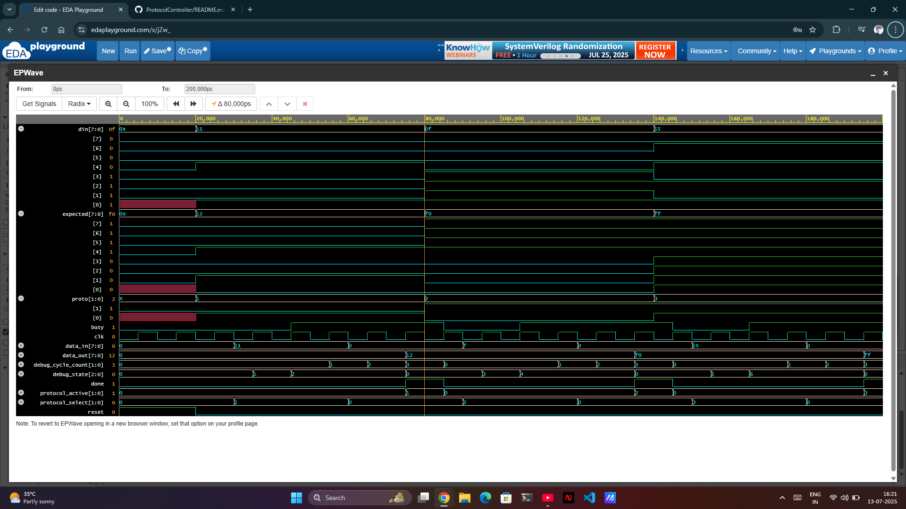
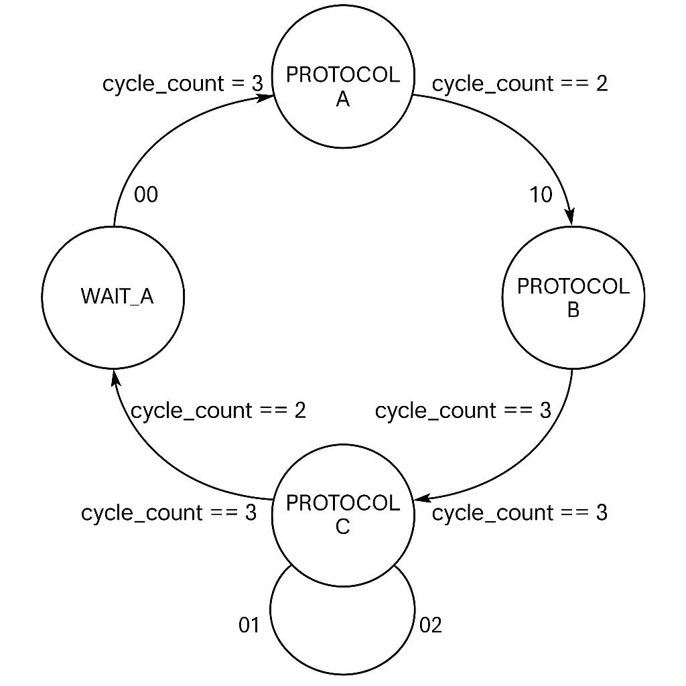

# ProtocolController – FSM-Based Protocol Handler

This project simulates a digital protocol controller using a Finite State Machine (FSM) in SystemVerilog.  
Tested and verified using EDA Playground.

## ✅ Supported Protocols
- Protocol A: Increment input (data_in + 1)
- Protocol B: Bitwise NOT (~data_in)
- Protocol C: XOR with 0xAA (data_in ^ 8'hAA)

## 🧪 Testbench
Self-checking testbench written in SystemVerilog.

## 📈 Waveform

## 📘 FSM Diagram

## Tools Used
- SystemVerilog (EDA Playground)
- GTKWave (for waveform analysis)
